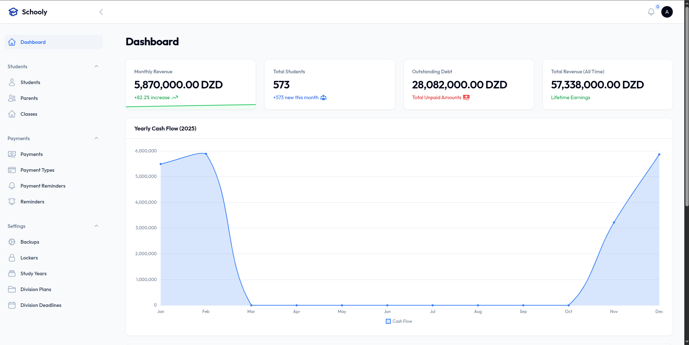
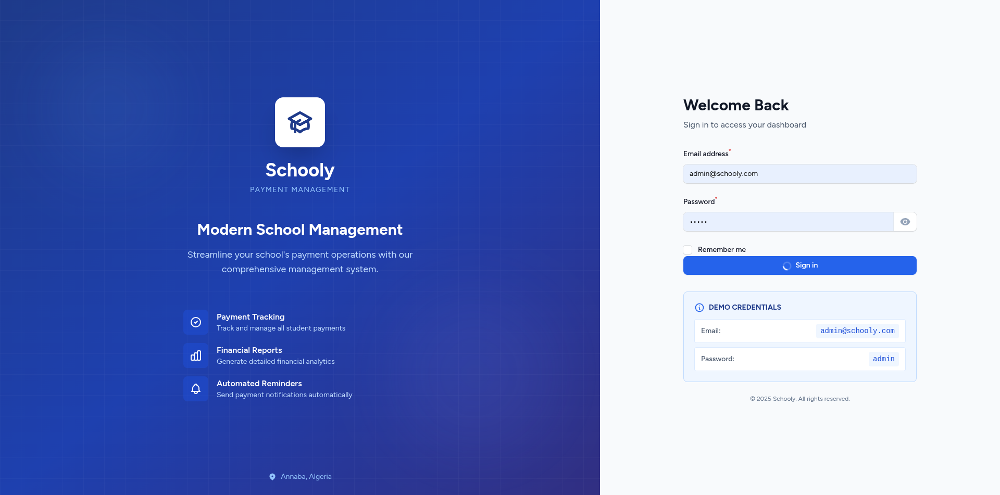

# 🎓 Schooly v2 - Payment Management System

<div align="center">


**A modern payment management system built with Laravel and FilamentPHP, designed for educational institutions to manage student payments, track cash flow, and organize administrative tasks efficiently.**

[Features](#-features) • [Screenshots](#-screenshots) • [Installation](#-installation) • [Tech Stack](#️-tech-stack) • [Author](#-author)

🌐 **[Live Demo](https://schooly.blamairia.me/admin)** — *Login: admin@schooly.com / admin*

</div>

---

## 🎯 Features

### Dashboard
- **Real-time Analytics**: Yearly cash flow visualization with interactive charts
- **Student Distribution**: Visual breakdown of students per class
- **Payment Statistics**: Instant overview of payment trends and metrics
- **Responsive Design**: Optimized for both desktop and mobile devices

### Student Management
- Comprehensive student records with payment tracking
- Advanced filtering system (Class, Study Year, External status, Outstanding debt)
- Optimized query performance with eager loading (eliminates N+1 queries)
- Parent/guardian information management
- Class assignment tracking

### Payment System
- Complete payment tracking and history
- Multiple payment type support
- Payment reminders and notifications
- Automated payment totals calculation
- Locker (Cassier) management

### Administrative Tools
- **Organized Sidebar Navigation**: Resources grouped into Students, Payments, and Settings
- **Custom Login Page**: Beautiful gradient design with demo credentials
- **Study Year Management**: Academic year tracking and organization
- **Division Plans & Deadlines**: Academic planning tools
- **Activity Logging**: Complete audit trail of system changes

## 📸 Screenshots

### Login Page


### Dashboard



## 🛠️ Tech Stack

- **Backend**: Laravel 10.x
- **Admin Panel**: FilamentPHP 3.x
- **Database**: Microsoft SQL Server (via sqlsrv driver)
- **Charts**: Native Filament Charts (Chart.js)
- **Frontend**: Livewire 3.x, Alpine.js, Tailwind CSS
- **Authentication**: Laravel Fortify & Jetstream
- **Containerization**: Docker & Docker Compose

## 📋 Requirements

- PHP 8.2 or higher
- Composer
- Docker & Docker Compose
- Microsoft SQL Server
- Node.js & NPM (for asset compilation)

## 🚀 Installation

### Using Docker (Recommended)

1. **Clone the repository**
   ```bash
   git clone https://github.com/blamairia/schooly-v2.git
   cd schooly-v2
   ```

2. **Configure environment**
   ```bash
   cp .env.example .env
   ```
   Update the `.env` file with your database credentials:
   ```env
   DB_CONNECTION=sqlsrv
   DB_HOST=your-sql-server-host
   DB_PORT=1433
   DB_DATABASE=your-database-name
   DB_USERNAME=your-username
   DB_PASSWORD=your-password
   ```

3. **Build and start containers**
   ```bash
   docker compose build --no-cache
   docker compose up -d
   ```

4. **Run migrations and seed demo data**
   ```bash
   docker exec schooly-app php artisan migrate --seed
   ```

5. **Access the application**
   - URL: `http://localhost:9000/admin`
   - Demo Email: `admin@schooly.com`
   - Demo Password: `admin`

### Manual Installation

1. **Install dependencies**
   ```bash
   composer install
   npm install && npm run build
   ```

2. **Generate application key**
   ```bash
   php artisan key:generate
   ```

3. **Run migrations**
   ```bash
   php artisan migrate --seed
   ```

4. **Start development server**
   ```bash
   php artisan serve
   ```

## 🎨 Key Improvements

### Performance Optimizations
- **Eliminated N+1 Queries**: Student page loads 10x faster with eager loading
- **Optimized Charts**: Switched to native Filament Charts for better stability
- **Cached Routes & Views**: Production-ready caching strategies

### User Experience
- **Custom Login**: Beautiful split-panel design with gradient background
- **Organized Navigation**: Sidebar grouped into logical sections
- **Enhanced Filters**: Advanced filtering options for better data management
- **Responsive Layout**: Fully responsive dashboard and widgets

### Code Quality
- **Clean Architecture**: Organized resources and widgets
- **Documented Code**: Comprehensive inline documentation
- **Error Handling**: Robust error handling and validation
- **Type Safety**: Strict typing throughout the codebase

## 📁 Project Structure

```
app/
├── Filament/
│   └── Admin/
│       ├── Pages/
│       │   └── Auth/
│       │       └── CustomLogin.php
│       ├── Resources/
│       │   ├── StudentResource.php
│       │   ├── PaymentResource.php
│       │   └── ...
│       └── Widgets/
│           ├── YearlyCashFlowChart.php
│           ├── StudentsPerClassChart.php
│           └── PaymentStatsWidget.php
├── Models/
│   ├── Student.php
│   ├── Payment.php
│   └── ...
└── Providers/
    └── Filament/
        └── AdminPanelProvider.php
```

## 🔧 Configuration

### Database Connection
The application uses SQL Server by default. Ensure you have the `sqlsrv` PHP extension installed. For Docker users, this is pre-configured in the `Dockerfile`.

### Admin Panel
Customize the admin panel in `app/Providers/Filament/AdminPanelProvider.php`:
- Brand name and logo
- Navigation groups
- Color scheme
- Authentication pages

### Charts
Modify chart configurations in `app/Filament/Admin/Widgets/`:
- `YearlyCashFlowChart.php` - Monthly payment trends
- `StudentsPerClassChart.php` - Student distribution

## 📊 Demo Data

The application includes a comprehensive seeder:
```bash
php artisan db:seed --class=DemoDataSeeder
```

This creates:
- 500+ demo students across 19 classes
- Payment records for the current year
- Study years, payment types, and administrative data

## 🤝 Contributing

Contributions are welcome! Please feel free to submit a Pull Request.

## 📝 License

This project is licensed under the MIT License.

## 👨‍💻 Author

**Billel Lamairia**

- 🌐 Portfolio: [blamairia.me](https://blamairia.me)
- 💻 GitHub: [@blamairia](https://github.com/blamairia)
- 🎮 Live Demo: [schooly.blamairia.me](https://schooly.blamairia.me)

Built with ❤️ for educational institutions.

## 🔒 Security

For security issues, please contact me directly via my portfolio.

---

**Note**: This is version 2 of the Schooly payment management system, completely rebuilt with modern technologies and improved UX.

